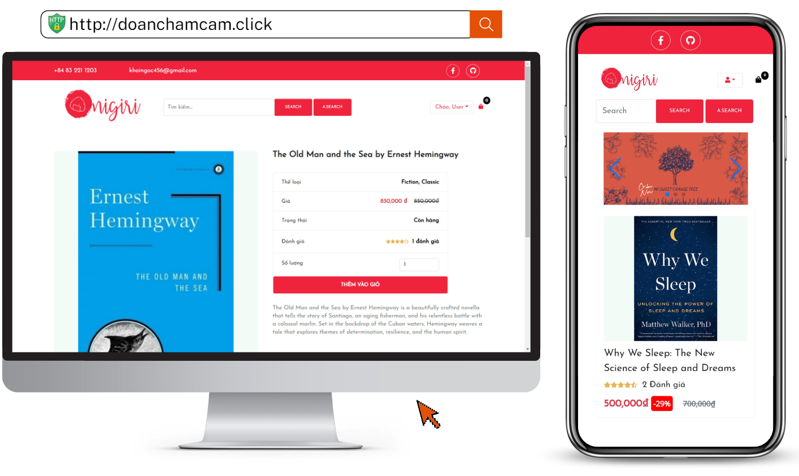

<p align="center">
  
</p>

# E-Commerce Website

## Description
E-Commerce Website (ECW) is an open-source web application developed using the following technologies:
- Front-end: ReactJS, Bootstrap 5, Redux
- Back-end: NodeJS, ExpressJS, MongoDB

## Features
- Users:
  1. Register an account
  2. Log in
  3. Search for products
  4. Advanced search based on categories
  5. Add products to the cart
  6. Manage cart items
  7. Manage user profile
  8. Change password
  9. View order status
  10. Complete order payment
- Admin:
  1. Manage products
  2. Add products
  3. Manage and update order status
  4. View sales statistics
  5. Manage users.

## Installation
# Connecting to the VPS

To connect your VPS server, you can use your server IP, you can create a root password and enter the server with your IP address and password credentials. But the more secure way is using an SSH key.

## Creating SSH Key

### For MAC OS / Linux / Windows 10 (with openssh)

1. Launch the Terminal app.
2. ```ssh-keygen -t rsa```
3. Press ```ENTER``` to store the key in the default folder /Users/CaoQuocViet/.ssh/id_rsa).

4. Type a passphrase (characters will not appear in the terminal).

5. Confirm your passphrase to finish SSH Keygen. You should get an output that looks something like this:

``` Your identification has been saved in /Users/CaoQuocViet/.ssh/id_rsa.
Your public key has been saved in /Users/CaoQuocViet/.ssh/id_rsa.pub.

+-----------------+ 
```
6. Copy your public SSH Key to your clipboard using the following code:
```pbcopy < ~/.ssh/id_rsa.pub```

### For Windows
1. Download PuTTY and PuTTYgen.
2. Open up PuTTYgen and click the ```Generate```.
3. Copy your key.
4. Enter a key passphrase and confirm.
5. Save the private key.


## Connection

After copying the SSH Key go the to hosting service provider dashboard and paste your key and save. After,

### For MAC OS / Linux

```bash
ssh root@<server ip address> 
```

### For Windows

1. Open the PuTTY app.
2. Enter your IP address.
3. Open the following section:
Connection - SSH - Auth
4. Browse the folders and choose your private key.

## First Configuration

### Deleting apache server

```
systemctl stop apache2
```

```
systemctl disable apache2
```

```
apt remove apache2
```

to delete related dependencies:
```
apt autoremove
```

### Cleaning and updating server
```
apt clean all && sudo apt update && sudo apt dist-upgrade
```

```
rm -rf /var/www/html
```

### Installing Nginx

```
apt install nginx
```

### Installing and configure Firewall

```
apt install ufw
```

```
ufw enable
```

```
ufw allow "Nginx Full"
```

## First Page

#### Delete the default server configuration

```
 rm /etc/nginx/sites-available/default
```

```
 rm /etc/nginx/sites-enabled/default
```

#### First configuration
```
 nano /etc/nginx/sites-available/doanchamcam.click
```
```
server {
  listen 80;

  location / {
        root /var/www/doanchamcam.click;
        index  index.html index.htm;
        proxy_http_version 1.1;
        proxy_set_header Upgrade $http_upgrade;
        proxy_set_header Connection 'upgrade';
        proxy_set_header Host $host;
        proxy_cache_bypass $http_upgrade;
        try_files $uri $uri/ /index.html;
  }
}

```

```
ln -s /etc/nginx/sites-available/doanchamcam.click /etc/nginx/sites-enabled/doanchamcam.click

```

##### Write your fist message
```
nano /var/www/doanchamcam.click/index.html

```

##### Start Nginx and check the page

```
systemctl start nginx
```

## Uploading Apps Using Git

```
apt install git
```

```
mkdir doanchamcam.click
```
```
cd doanchamcam.click
```

```
git clone https://github.com/CaoQuocViet/E-commerce-Website.git
```

## Nginx Configuration for new apps
```
nano /etc/nginx/sites-available/doanchamcam.click
```
```
location /api {
        proxy_pass http://45.90.108.107:8800; // Your VPS IP
        proxy_http_version 1.1;
        proxy_set_header Upgrade $http_upgrade;
        proxy_set_header Connection 'upgrade';
        proxy_set_header Host $host;
        proxy_cache_bypass $http_upgrade;
  }
```

##### If you check the location /api you are going to get "502" error which is good. Our configuration works. The only thing we need to is running our app

```
// Install nvm and nodejs
curl -o- https://raw.githubusercontent.com/nvm-sh/nvm/v0.39.0/install.sh | bash
source ~/.bashrc
nvm install 16.16.0
nvm use 16.16.0
nvm alias default 16.16.0
```

```
apt install npm
```

```
cd server
```
```
npm install
```
```
nano .env
```
##### Copy and paste your env file
```
node server.js
```

#### But if you close your ssh session here. It's gonna kill this process. To prevent this we are going to need a package which is called ```pm2```
```
npm i -g pm2
```
Let's create a new pm2 instance

```
pm2 start --name server server.js   
```
```
pm2 startup ubuntu 
```

## React App Deployment

```
cd ../mainpage
```

```
nano .env
```
Paste your env file.

```
npm i
```
Let's create the build file

```
npm run build
```

Right now, we should move this build file into the main web file

```
rm -rf /var/www/mainpage/*
```
```
mkdir /var/www/doanchamcam.click/mainpage
```

```
cp -r build/* /var/www/doanchamcam.click/mainpage
```

Let's make some server configuration
```
 location / {
        root /var/www/doanchamcam.click/mainpage/;
        index  index.html index.htm;
        proxy_http_version 1.1;
        proxy_set_header Upgrade $http_upgrade;
        proxy_set_header Connection 'upgrade';
        proxy_set_header Host $host;
        proxy_cache_bypass $http_upgrade;
        try_files $uri $uri/ /index.html;
  }

```
### Adding Domain
1 - Make sure that you created your A records on your domain provider website.

2 - Change your pathname from Router

3 - Change your env files and add the new API address 

4 - Add the following server config
```
server {
 listen 80;
 server_name doanchamcam.click www.doanchamcam.click;

location / {
 root /var/www/doanchamcam.click/mainpage;
 index  index.html index.htm;
 proxy_http_version 1.1;
 proxy_set_header Upgrade $http_upgrade;
 proxy_set_header Connection 'upgrade';
 proxy_set_header Host $host;
 proxy_cache_bypass $http_upgrade;
 try_files $uri $uri/ /index.html;
}
}

server {
  listen 80;
  server_name server.doanchamcam.click;
  location / {
    proxy_pass http://45.90.108.107:8800;
    proxy_http_version 1.1;
    proxy_set_header Upgrade $http_upgrade;
    proxy_set_header Connection 'upgrade';
    proxy_set_header Host $host;
    proxy_cache_bypass $http_upgrade;
    }
}

server {
  listen 80;
  server_name dashboard.doanchamcam.click;
  location / {
    root /var/www/doanchamcam.click/dashboard;
    index  index.html index.htm;
    proxy_http_version 1.1;
    proxy_set_header Upgrade $http_upgrade;
    proxy_set_header Connection 'upgrade';
    proxy_set_header Host $host;
    proxy_cache_bypass $http_upgrade;
    try_files $uri $uri/ /index.html;
  }
}
```

## SSL Certification
```
apt install certbot python3-certbot-nginx
```

Make sure that Nginx Full rule is available
```
ufw status
```

```
certbot --nginx -d example.com -d www.example.com
```

Let’s Encrypt’s certificates are only valid for ninety days. To set a timer to validate automatically:
```
systemctl status certbot.timer
```

## Contribution
**Phạm Ngọc Khôi**: https://github.com/khoipn21 <br>
**Cao Quốc Việt**: https://github.com/CaoQuocViet
